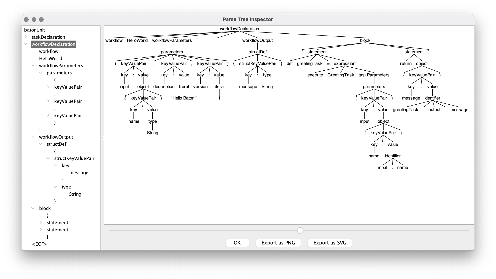

# Baton

> _This is a Work In Progress!!! The translator
is not fully functional yet and the language grammar is still changing._

Baton is a language designed to simplify the process of creating and maintaining workflows
for developers using Netflix Conductor.

Where does the name come from? a baton is a light, thin stick used by a conductor to direct an orchestra.

## Hello World!

This Baton Workflow:

```
// Task declarations provide type safety
task GreetingTask {
    input: { name: String },
    output: { message: String },
    description: "Give me a name and I'll say hi!"
}

workflow HelloWorld (
    input : { name: String },
    description: "Hello Baton!",
    version : 2
) : { message : String } {
    greetingTask := GreetingTask(input : {name: input.name},
        description: "Use GreetingTask to say hi!",
        retryCount: 10)
    return { message: greetingTask.output.message }
}
```

translates to this Conductor Workflow:

```json
{
  "name": "HelloWorld",
  "description": "Hello Baton!",
  "version": 2,
  "tasks": [
    {
      "name": "greetingTask",
      "taskReferenceName": "greetingTask",
      "description": "Use GreetingTask to say hi!",
      "inputParameters": {
        "name": "${workflow.input.name}"
      },
      "type": "SIMPLE",
      "startDelay": 0,
      "optional": false,
      "asyncComplete": false,
      "retryCount": 10
    }
  ],
  "inputParameters": [
    "name"
  ],
  "outputParameters": {
    "message": "${greetingTask.output.message}"
  },
  "schemaVersion": 2,
  "restartable": true,
  "workflowStatusListenerEnabled": false,
  "timeoutPolicy": "ALERT_ONLY",
  "timeoutSeconds": 0
}
```

This might not be very impressive, but it's a start.

To try it out you can run:

```shell
./gradlew build
java -jar build/libs/baton-1.0-SNAPSHOT.jar -f samples/sample0.baton
```

## Parse Tree inspector

You can take a look at the parse tree with Antlr's inspector GUI. This is very useful if there's a syntax error
because at the moment the error handler strategy (`BailErrorStrategy`) just terminates the parsing in case of an error.
Improving the error handling and messaging is in the TODO list.

```shell
./gradlew build
java -jar build/libs/baton-1.0-SNAPSHOT.jar -f samples/sample0.baton
```



---
## Language constructs (WIP)

Baton intends to offer intuitive language constructs, like **IF statements** (WIP) and **WHILE loops** (WIP), which
will result familiar to any developer. While Netflix Conductor does have built-in tasks for these operations,
its JSON DSL can be somewhat challenging to read and understand; after all JSON is a data language and was
not intended to support things like control structures or type checking.

### If Statements

An `if` is probably the simplest and most used control structure of all. Baton uses Conductor's [Switch Operator](https://conductor.netflix.com/reference-docs/switch-task.html).

This Baton workflow:
```
workflow Payment (input : { uid: String, amount: Integer }, version : 1, ownerEmail: "someone@email.com") {
    balance := CheckBalance(input : {uid : input.uid})
    if (balance.credit > input.amount) {
        PayWithCredit()
    } else {
        ErrorEmail()
        CancelOrder()
    }
}
```

is translated to:
```json
{
  "accessPolicy" : { },
  "name" : "Payment",
  "version" : 1,
  "tasks" : [ {
    "name" : "CheckBalance",
    "taskReferenceName" : "balance_2",
    "inputParameters" : {
      "uid" : "${workflow.input.uid}"
    },
    "type" : "SIMPLE",
    "startDelay" : 0,
    "optional" : false,
    "asyncComplete" : false
  }, {
    "name" : "set_balance_2",
    "taskReferenceName" : "set_balance_2",
    "inputParameters" : {
      "balance" : "${balance_2.output}"
    },
    "type" : "SET_VARIABLE",
    "startDelay" : 0,
    "optional" : false,
    "asyncComplete" : false
  }, {
    "name" : "if_stmt_3",
    "taskReferenceName" : "if_stmt_3",
    "inputParameters" : {
      "input" : "${workflow.input}",
      "balance" : "${workflow.variables.balance}"
    },
    "type" : "SWITCH",
    "decisionCases" : {
      "true" : [ {
        "name" : "PayWithCredit",
        "taskReferenceName" : "PayWithCredit_4",
        "inputParameters" : { },
        "type" : "SIMPLE",
        "startDelay" : 0,
        "optional" : false,
        "asyncComplete" : false
      } ],
      "false" : [ {
        "name" : "ErrorEmail",
        "taskReferenceName" : "ErrorEmail_6",
        "inputParameters" : { },
        "type" : "SIMPLE",
        "startDelay" : 0,
        "optional" : false,
        "asyncComplete" : false
      }, {
        "name" : "CancelOrder",
        "taskReferenceName" : "CancelOrder_7",
        "inputParameters" : { },
        "type" : "SIMPLE",
        "startDelay" : 0,
        "optional" : false,
        "asyncComplete" : false
      } ]
    },
    "startDelay" : 0,
    "optional" : false,
    "asyncComplete" : false,
    "evaluatorType" : "javascript",
    "expression" : "$.balance.credit > $.input.amount"
  } ],
  "inputParameters" : [ "uid", "amount" ],
  "outputParameters" : { },
  "schemaVersion" : 2,
  "restartable" : true,
  "workflowStatusListenerEnabled" : false,
  "ownerEmail" : "someone@email.com",
  "timeoutPolicy" : "ALERT_ONLY",
  "timeoutSeconds" : 0,
  "variables" : { },
  "inputTemplate" : { }
}
```

<p align="center">
  
</p>

### While Statements

Conductor has a [DO WHILE operator](https://conductor.netflix.com/reference-docs/do-while-task.html) for loops and as 
expected it behaves like the control structure, which means that all tasks in the loop are 
executed once. But, it seems this could be counterintuitive; read: [Uber Cadence VS Netflix Conductor](https://www.instaclustr.com/blog/workflow-comparison-uber-cadence-vs-netflix-conductor/).

To give WHILE semantics (nothing in the loop is executed if the condition is not met) the translated workflow
uses a SWITCH task as an IF guard and then a DO WHILE task. It also stores the output of the tasks in a workflow
variable (`workflows.variables`) using a [SET VARIABLE task](https://conductor.netflix.com/reference-docs/set-variable-task.html)
to reference it and update it.

This Baton workflow:
```
workflow Loop (input : { uid: String }, version : 1, ownerEmail: "someone@email.com") {
  user := GetUserByID(input : {uid : input.uid})
  // active wait for the user to be activated
  while(!user.active) {
      user = GetUserByID(input : {uid : input.uid})
      // in real life there should be a wait here and a limit for the loop
  }
}
```

is translated to:

```json
{
  "accessPolicy" : { },
  "name" : "Loop",
  "version" : 1,
  "tasks" : [ {
    "name" : "GetUserByID",
    "taskReferenceName" : "user_2",
    "inputParameters" : {
      "uid" : "${workflow.input.uid}"
    },
    "type" : "SIMPLE",
    "startDelay" : 0,
    "optional" : false,
    "asyncComplete" : false
  }, {
    "name" : "set_user_2",
    "taskReferenceName" : "set_user_2",
    "inputParameters" : {
      "user" : "${user_2.output}"
    },
    "type" : "SET_VARIABLE",
    "startDelay" : 0,
    "optional" : false,
    "asyncComplete" : false
  }, {
    "name" : "if_stmt_4",
    "taskReferenceName" : "if_stmt_4",
    "inputParameters" : {
      "user" : "${workflow.variables.user}"
    },
    "type" : "SWITCH",
    "decisionCases" : {
      "true" : [ {
        "name" : "do_while_stmt_4",
        "taskReferenceName" : "do_while_stmt_4",
        "inputParameters" : {
          "user" : "${workflow.variables.user}"
        },
        "type" : "DO_WHILE",
        "startDelay" : 0,
        "optional" : false,
        "asyncComplete" : false,
        "loopCondition" : "!$.user.active",
        "loopOver" : [ {
          "name" : "GetUserByID",
          "taskReferenceName" : "user_5",
          "inputParameters" : {
            "uid" : "${workflow.input.uid}"
          },
          "type" : "SIMPLE",
          "startDelay" : 0,
          "optional" : false,
          "asyncComplete" : false
        }, {
          "name" : "set_user_5",
          "taskReferenceName" : "set_user_5",
          "inputParameters" : {
            "user" : "${user_5.output}"
          },
          "type" : "SET_VARIABLE",
          "startDelay" : 0,
          "optional" : false,
          "asyncComplete" : false
        } ]
      } ]
    },
    "startDelay" : 0,
    "optional" : false,
    "asyncComplete" : false,
    "evaluatorType" : "javascript",
    "expression" : "!$.user.active"
  } ],
  "inputParameters" : [ "uid" ],
  "outputParameters" : { },
  "schemaVersion" : 2,
  "restartable" : true,
  "workflowStatusListenerEnabled" : false,
  "ownerEmail" : "someone@email.com",
  "timeoutPolicy" : "ALERT_ONLY",
  "timeoutSeconds" : 0,
  "variables" : { },
  "inputTemplate" : { }
}
```

<p align="center">
  
</p>

---
## Type safety (WIP)

Baton includes built-in (optional) type checking to ensure that your workflows are correct.
For example, if you try to pass a String to a task that expects an Integer,
Baton will raise an error. This helps to catch errors early,
before they cause problems in your running workflows (_Check
out [this workflow](https://github.com/jmigueprieto/baton/blob/15e4d7aefd5c9a0e1414d76a3686f69bfee4139c/src/test/resources/invalid-task-input.baton#L18)
and [this test](https://github.com/jmigueprieto/baton/blob/15e4d7aefd5c9a0e1414d76a3686f69bfee4139c/src/test/java/mprieto/baton/workflows/WorkflowListenerTest.java#L65)_).

However, keep in mind that when executing in Conductor these types won't be enforced. Think of this as type-erasure.

---
## Code generators (WIP)

Last but not least when defining Tasks in Baton these definitions could be used to generate
project templates containing workers with their respective inputs and outputs in languages like Java, Python, C#, etc.


